# CI Status (of main)

The following table shows the status for all jobs in this repository.

[//]: # ({{print badges}})

|     | build-spec | lint-spec | build | lint | test | build-docker |
| --- | --- | --- | --- | --- | --- | --- |
| helper/development-container |   |  | [](https://ci.goldi-labs.de/crosslab/main/helper/development-container/dist/build.log) |  |  |  |
| helper/tsdoc-theme |   |  | [](https://ci.goldi-labs.de/crosslab/main/helper/tsdoc-theme/dist/build.log) | [](https://ci.goldi-labs.de/crosslab/main/helper/tsdoc-theme/dist/lint.log) |  |  |
| helper/openapi-codegeneration |   |  | [](https://ci.goldi-labs.de/crosslab/main/helper/openapi-codegeneration/dist/build.log) | [](https://ci.goldi-labs.de/crosslab/main/helper/openapi-codegeneration/dist/lint.log) |  |  |
| helper/crosslab-typescript-addon |   |  | [](https://ci.goldi-labs.de/crosslab/main/helper/crosslab-typescript-addon/dist/build.log) | [](https://ci.goldi-labs.de/crosslab/main/helper/crosslab-typescript-addon/dist/lint.log) |  |  |
| helper/python-test-helper |   |  | [](https://ci.goldi-labs.de/crosslab/main/helper/python-test-helper/dist/build.log) | [](https://ci.goldi-labs.de/crosslab/main/helper/python-test-helper/dist/lint.log) | [](https://ci.goldi-labs.de/crosslab/main/helper/python-test-helper/dist/test.log) |  |
| helper/dummy-device/js |   |  | [](https://ci.goldi-labs.de/crosslab/main/helper/dummy-device/js/dist/build.log) | [](https://ci.goldi-labs.de/crosslab/main/helper/dummy-device/js/dist/lint.log) |  |  |
| helper/dummy-device/python |   |  | [](https://ci.goldi-labs.de/crosslab/main/helper/dummy-device/python/dist/build.log) | [](https://ci.goldi-labs.de/crosslab/main/helper/dummy-device/python/dist/lint.log) |  |  |
| services/common |   |  | [](https://ci.goldi-labs.de/crosslab/main/services/common/dist/build.log) | [](https://ci.goldi-labs.de/crosslab/main/services/common/dist/lint.log) |  |  |
| services/auth |  [](https://ci.goldi-labs.de/crosslab/main/services/auth/dist/build-spec.log) | [](https://ci.goldi-labs.de/crosslab/main/services/auth/dist/lint-spec.log) | [](https://ci.goldi-labs.de/crosslab/main/services/auth/dist/build.log) | [](https://ci.goldi-labs.de/crosslab/main/services/auth/dist/lint.log) | [](https://ci.goldi-labs.de/crosslab/main/services/auth/dist/test.log) | [](https://ci.goldi-labs.de/crosslab/main/services/auth/dist/build-docker.log) |
| services/booking |  [](https://ci.goldi-labs.de/crosslab/main/services/booking/dist/build-spec.log) | [](https://ci.goldi-labs.de/crosslab/main/services/booking/dist/lint-spec.log) |  |  |  |  |
| services/device |  [](https://ci.goldi-labs.de/crosslab/main/services/device/dist/build-spec.log) | [](https://ci.goldi-labs.de/crosslab/main/services/device/dist/lint-spec.log) | [](https://ci.goldi-labs.de/crosslab/main/services/device/dist/build.log) |  | [](https://ci.goldi-labs.de/crosslab/main/services/device/dist/test.log) | [](https://ci.goldi-labs.de/crosslab/main/services/device/dist/build-docker.log) |
| services/experiment |  [](https://ci.goldi-labs.de/crosslab/main/services/experiment/dist/build-spec.log) | [](https://ci.goldi-labs.de/crosslab/main/services/experiment/dist/lint-spec.log) | [](https://ci.goldi-labs.de/crosslab/main/services/experiment/dist/build.log) | [](https://ci.goldi-labs.de/crosslab/main/services/experiment/dist/lint.log) |  | [](https://ci.goldi-labs.de/crosslab/main/services/experiment/dist/build-docker.log) |
| services/federation |  [](https://ci.goldi-labs.de/crosslab/main/services/federation/dist/build-spec.log) | [](https://ci.goldi-labs.de/crosslab/main/services/federation/dist/lint-spec.log) | [](https://ci.goldi-labs.de/crosslab/main/services/federation/dist/build.log) |  |  | [](https://ci.goldi-labs.de/crosslab/main/services/federation/dist/build-docker.log) |
| services/update |  [](https://ci.goldi-labs.de/crosslab/main/services/update/dist/build-spec.log) | [](https://ci.goldi-labs.de/crosslab/main/services/update/dist/lint-spec.log) | [](https://ci.goldi-labs.de/crosslab/main/services/update/dist/build.log) |  |  | [](https://ci.goldi-labs.de/crosslab/main/services/update/dist/build-docker.log) |
| services/openapi |   |  | [](https://ci.goldi-labs.de/crosslab/main/services/openapi/dist/build.log) | [](https://ci.goldi-labs.de/crosslab/main/services/openapi/dist/lint.log) |  |  |
| services/gateway |   |  | [](https://ci.goldi-labs.de/crosslab/main/services/gateway/dist/build.log) |  |  | [](https://ci.goldi-labs.de/crosslab/main/services/gateway/dist/build-docker.log) |
| clients/api/js |   |  | [](https://ci.goldi-labs.de/crosslab/main/clients/api/js/dist/build.log) | [](https://ci.goldi-labs.de/crosslab/main/clients/api/js/dist/lint.log) |  |  |
| clients/api/python |   |  | [](https://ci.goldi-labs.de/crosslab/main/clients/api/python/dist/build.log) | [](https://ci.goldi-labs.de/crosslab/main/clients/api/python/dist/lint.log) | [](https://ci.goldi-labs.de/crosslab/main/clients/api/python/dist/test.log) |  |
| clients/soa/python |   |  | [](https://ci.goldi-labs.de/crosslab/main/clients/soa/python/dist/build.log) | [](https://ci.goldi-labs.de/crosslab/main/clients/soa/python/dist/lint.log) | [](https://ci.goldi-labs.de/crosslab/main/clients/soa/python/dist/test.log) |  |
| clients/soa/js |   |  | [](https://ci.goldi-labs.de/crosslab/main/clients/soa/js/dist/build.log) | [](https://ci.goldi-labs.de/crosslab/main/clients/soa/js/dist/lint.log) |  |  |
| clients/soa_services/electricalConnection/python |   |  | [](https://ci.goldi-labs.de/crosslab/main/clients/soa_services/electricalConnection/python/dist/build.log) | [](https://ci.goldi-labs.de/crosslab/main/clients/soa_services/electricalConnection/python/dist/lint.log) | [](https://ci.goldi-labs.de/crosslab/main/clients/soa_services/electricalConnection/python/dist/test.log) |  |
| clients/soa_services/electricalConnection/js |   |  | [](https://ci.goldi-labs.de/crosslab/main/clients/soa_services/electricalConnection/js/dist/build.log) | [](https://ci.goldi-labs.de/crosslab/main/clients/soa_services/electricalConnection/js/dist/lint.log) |  |  |
| clients/soa_services/webcam/python |   |  | [](https://ci.goldi-labs.de/crosslab/main/clients/soa_services/webcam/python/dist/build.log) | [](https://ci.goldi-labs.de/crosslab/main/clients/soa_services/webcam/python/dist/lint.log) | [](https://ci.goldi-labs.de/crosslab/main/clients/soa_services/webcam/python/dist/test.log) |  |
| clients/soa_services/webcam/js |   |  | [](https://ci.goldi-labs.de/crosslab/main/clients/soa_services/webcam/js/dist/build.log) | [](https://ci.goldi-labs.de/crosslab/main/clients/soa_services/webcam/js/dist/lint.log) |  |  |
| clients/soa_services/file/python |   |  | [](https://ci.goldi-labs.de/crosslab/main/clients/soa_services/file/python/dist/build.log) | [](https://ci.goldi-labs.de/crosslab/main/clients/soa_services/file/python/dist/lint.log) | [](https://ci.goldi-labs.de/crosslab/main/clients/soa_services/file/python/dist/test.log) |  |
| clients/soa_services/file/js |   |  | [](https://ci.goldi-labs.de/crosslab/main/clients/soa_services/file/js/dist/build.log) | [](https://ci.goldi-labs.de/crosslab/main/clients/soa_services/file/js/dist/lint.log) |  |  |
| clients/soa_services/message/python |   |  | [](https://ci.goldi-labs.de/crosslab/main/clients/soa_services/message/python/dist/build.log) | [](https://ci.goldi-labs.de/crosslab/main/clients/soa_services/message/python/dist/lint.log) | [](https://ci.goldi-labs.de/crosslab/main/clients/soa_services/message/python/dist/test.log) |  |
| clients/soa_services/message/js |   |  | [](https://ci.goldi-labs.de/crosslab/main/clients/soa_services/message/js/dist/build.log) | [](https://ci.goldi-labs.de/crosslab/main/clients/soa_services/message/js/dist/lint.log) |  |  |
| integration-test |   |  |  | [](https://ci.goldi-labs.de/crosslab/main/integration-test/dist/lint.log) | [](https://ci.goldi-labs.de/crosslab/main/integration-test/dist/test.log) |  |

[//]: # ({{end}})


[//]: # ({{print dependency graph}})

```mermaid
graph LR
%%{init:{'flowchart':{'nodeSpacing': 20, 'rankSpacing': 80, 'curve': 'linear', 'useMaxWidth': false}}}%%
  subgraph clients/api/js
    clients/api/js:build[build]
    clients/api/js:lint[lint]
  end
  subgraph clients/api/python
    clients/api/python:build[build]
    clients/api/python:lint[lint]
    clients/api/python:test[test]
  end
  subgraph clients/soa/js
    clients/soa/js:build[build]
    clients/soa/js:lint[lint]
  end
  subgraph clients/soa/python
    clients/soa/python:build[build]
    clients/soa/python:lint[lint]
    clients/soa/python:test[test]
  end
  subgraph clients/soa_services/electricalConnection/js
    clients/soa_services/electricalConnection/js:build[build]
    clients/soa_services/electricalConnection/js:lint[lint]
  end
  subgraph clients/soa_services/electricalConnection/python
    clients/soa_services/electricalConnection/python:build[build]
    clients/soa_services/electricalConnection/python:lint[lint]
    clients/soa_services/electricalConnection/python:test[test]
  end
  subgraph clients/soa_services/file/js
    clients/soa_services/file/js:build[build]
    clients/soa_services/file/js:lint[lint]
  end
  subgraph clients/soa_services/file/python
    clients/soa_services/file/python:build[build]
    clients/soa_services/file/python:lint[lint]
    clients/soa_services/file/python:test[test]
  end
  subgraph clients/soa_services/message/js
    clients/soa_services/message/js:build[build]
    clients/soa_services/message/js:lint[lint]
  end
  subgraph clients/soa_services/message/python
    clients/soa_services/message/python:build[build]
    clients/soa_services/message/python:lint[lint]
    clients/soa_services/message/python:test[test]
  end
  subgraph clients/soa_services/webcam/js
    clients/soa_services/webcam/js:build[build]
    clients/soa_services/webcam/js:lint[lint]
  end
  subgraph clients/soa_services/webcam/python
    clients/soa_services/webcam/python:build[build]
    clients/soa_services/webcam/python:lint[lint]
    clients/soa_services/webcam/python:test[test]
  end
  subgraph helper/crosslab-typescript-addon
    helper/crosslab-typescript-addon:build[build]
    helper/crosslab-typescript-addon:lint[lint]
  end
  subgraph helper/development-container
    helper/development-container:build[build]
  end
  subgraph helper/dummy-device/js
    helper/dummy-device/js:build[build]
    helper/dummy-device/js:lint[lint]
  end
  subgraph helper/dummy-device/python
    helper/dummy-device/python:build[build]
    helper/dummy-device/python:lint[lint]
  end
  subgraph helper/openapi-codegeneration
    helper/openapi-codegeneration:build[build]
    helper/openapi-codegeneration:lint[lint]
  end
  subgraph helper/python-test-helper
    helper/python-test-helper:build[build]
    helper/python-test-helper:lint[lint]
    helper/python-test-helper:test[test]
  end
  subgraph helper/tsdoc-theme
    helper/tsdoc-theme:build[build]
    helper/tsdoc-theme:lint[lint]
  end
  subgraph integration-test
    integration-test:lint[lint]
    integration-test:test[test]
  end
  subgraph services/auth
    services/auth:build[build]
    services/auth:build-docker[build-docker]
    services/auth:build-spec[build-spec]
    services/auth:lint[lint]
    services/auth:lint-spec[lint-spec]
    services/auth:test[test]
  end
  subgraph services/booking
    services/booking:build-spec[build-spec]
    services/booking:lint-spec[lint-spec]
  end
  subgraph services/common
    services/common:build[build]
    services/common:lint[lint]
  end
  subgraph services/device
    services/device:build[build]
    services/device:build-docker[build-docker]
    services/device:build-spec[build-spec]
    services/device:lint-spec[lint-spec]
    services/device:test[test]
  end
  subgraph services/experiment
    services/experiment:build[build]
    services/experiment:build-docker[build-docker]
    services/experiment:build-spec[build-spec]
    services/experiment:lint[lint]
    services/experiment:lint-spec[lint-spec]
  end
  subgraph services/federation
    services/federation:build[build]
    services/federation:build-docker[build-docker]
    services/federation:build-spec[build-spec]
    services/federation:lint-spec[lint-spec]
  end
  subgraph services/gateway
    services/gateway:build[build]
    services/gateway:build-docker[build-docker]
  end
  subgraph services/openapi
    services/openapi:build[build]
    services/openapi:lint[lint]
  end
  subgraph services/update
    services/update:build[build]
    services/update:build-docker[build-docker]
    services/update:build-spec[build-spec]
    services/update:lint-spec[lint-spec]
  end
clients/api/js --> helper/dummy-device/js
clients/api/js --> integration-test
clients/api/js --> services/auth
clients/api/js --> services/device
clients/api/js --> services/experiment
clients/api/js --> services/federation
clients/api/js --> services/update
clients/api/python --> clients/soa/python
clients/api/python --> clients/soa_services/electricalConnection/python
clients/api/python --> clients/soa_services/file/python
clients/api/python --> clients/soa_services/message/python
clients/api/python --> clients/soa_services/webcam/python
clients/api/python --> helper/dummy-device/python
clients/soa/js --> clients/soa_services/electricalConnection/js
clients/soa/js --> clients/soa_services/file/js
clients/soa/js --> clients/soa_services/message/js
clients/soa/js --> clients/soa_services/webcam/js
clients/soa/js --> helper/dummy-device/js
clients/soa/js --> integration-test
clients/soa/python --> clients/soa_services/electricalConnection/python
clients/soa/python --> clients/soa_services/file/python
clients/soa/python --> clients/soa_services/message/python
clients/soa/python --> clients/soa_services/webcam/python
clients/soa/python --> helper/dummy-device/python
clients/soa_services/electricalConnection/js --> helper/dummy-device/js
clients/soa_services/electricalConnection/js --> integration-test
clients/soa_services/electricalConnection/python --> helper/dummy-device/python
clients/soa_services/file/js --> helper/dummy-device/js
clients/soa_services/webcam/js --> helper/dummy-device/js
helper/crosslab-typescript-addon --> clients/api/js
helper/crosslab-typescript-addon --> services/auth
helper/crosslab-typescript-addon --> services/device
helper/crosslab-typescript-addon --> services/experiment
helper/crosslab-typescript-addon --> services/federation
helper/crosslab-typescript-addon --> services/update
helper/dummy-device/js --> integration-test
helper/dummy-device/python --> integration-test
helper/openapi-codegeneration --> clients/api/js
helper/openapi-codegeneration --> clients/api/python
helper/openapi-codegeneration --> clients/soa/python
helper/openapi-codegeneration --> clients/soa_services/electricalConnection/python
helper/openapi-codegeneration --> helper/crosslab-typescript-addon
helper/openapi-codegeneration --> services/auth
helper/openapi-codegeneration --> services/device
helper/openapi-codegeneration --> services/experiment
helper/openapi-codegeneration --> services/federation
helper/openapi-codegeneration --> services/update
helper/python-test-helper --> clients/soa/python
helper/python-test-helper --> clients/soa_services/electricalConnection/python
helper/python-test-helper --> clients/soa_services/file/python
helper/python-test-helper --> clients/soa_services/message/python
helper/python-test-helper --> clients/soa_services/webcam/python
helper/tsdoc-theme --> clients/api/js
services/auth --> clients/api/js
services/auth --> integration-test
services/auth --> services/device
services/auth --> services/openapi
services/booking --> clients/api/js
services/booking --> services/openapi
services/common --> integration-test
services/common --> services/auth
services/common --> services/device
services/common --> services/experiment
services/common --> services/federation
services/common --> services/update
services/device --> clients/api/js
services/device --> integration-test
services/device --> services/openapi
services/experiment --> clients/api/js
services/experiment --> integration-test
services/experiment --> services/openapi
services/federation --> clients/api/js
services/federation --> integration-test
services/federation --> services/openapi
services/gateway --> integration-test
services/openapi --> clients/api/js
services/openapi --> clients/api/python
services/openapi --> clients/soa/python
services/update --> clients/api/js
services/update --> services/openapi
```

[//]: # ({{end}})


## Publishing

run `./scripts/ci.sh --release`

Create `$HOME/.pypirc` with the following content:
```
[pypi]
    username: XXXXXX
    password: xxxxxxxxxxxxxxxx
```

npm adduser

run `./scripts/publish.sh --latest`