# CI Status

The following table shows the status for all jobs in this repository.

> **Important** The README.md must be updated whenever the branch is switched.
> This can be done by running `scripts/housekeeping.sh`. For your convenience
> this script can be run as pre-commit hook. Run `scripts/install-hooks.sh` to
> install the hook.

[//]: # ({{print badges}})

|     | build-spec | build | lint | test |
| --- | --- | --- | --- | --- |
| helper/development-container |   |  |  |  |
| helper/tsdoc-theme |   |  |  |  |
| helper/openapi-codegeneration |   |  |  |  |
| helper/crosslab-typescript-addon |   |  |  |  |
| services/common |   |  |  |  |
| services/auth |   |  |  |  |
| services/booking |   |  |  |  |
| services/device |   |  |  |  |
| services/experiment |   |  |  |  |
| services/federation |   |  |  |  |
| services/update |   |  |  |  |
| services/openapi |   |  |  |  |
| services/gateway |   |  |  |  |
| clients/api/js |   |  |  |  |
| clients/api/python |   |  |  |  |
| clients/soa/python |   |  |  |  |
| clients/soa_services/electricalConnection/python |   |  |  |  |

[//]: # ({{end}})

[//]: # ({{print dependency graph}})

```mermaid
graph LR
%%{init:{'flowchart':{'nodeSpacing': 20, 'rankSpacing': 80, 'curve': 'linear', 'useMaxWidth': false}}}%%
  subgraph clients/api/js
    clients/api/js:build[build]
  end
  subgraph clients/api/python
    clients/api/python:build[build]
    clients/api/python:lint[lint]
    clients/api/python:test[test]
  end
  subgraph clients/soa/python
    clients/soa/python:build[build]
    clients/soa/python:lint[lint]
    clients/soa/python:test[test]
  end
  subgraph clients/soa_services/electricalConnection/python
    clients/soa_services/electricalConnection/python:build[build]
    clients/soa_services/electricalConnection/python:lint[lint]
    clients/soa_services/electricalConnection/python:test[test]
  end
  subgraph helper/crosslab-typescript-addon
    helper/crosslab-typescript-addon:build[build]
  end
  subgraph helper/development-container
    helper/development-container:build[build]
  end
  subgraph helper/openapi-codegeneration
    helper/openapi-codegeneration:build[build]
  end
  subgraph helper/tsdoc-theme
    helper/tsdoc-theme:build[build]
  end
  subgraph services/auth
    services/auth:build[build]
    services/auth:build-spec[build-spec]
    services/auth:lint[lint]
  end
  subgraph services/booking
    services/booking:build-spec[build-spec]
    services/booking:lint[lint]
  end
  subgraph services/common
    services/common:build[build]
  end
  subgraph services/device
    services/device:build[build]
    services/device:build-spec[build-spec]
    services/device:lint[lint]
  end
  subgraph services/experiment
    services/experiment:build[build]
    services/experiment:build-spec[build-spec]
    services/experiment:lint[lint]
  end
  subgraph services/federation
    services/federation:build[build]
    services/federation:build-spec[build-spec]
    services/federation:lint[lint]
  end
  subgraph services/gateway
    services/gateway:build[build]
  end
  subgraph services/openapi
    services/openapi:build-spec[build-spec]
    services/openapi:lint[lint]
  end
  subgraph services/update
    services/update:build[build]
    services/update:build-spec[build-spec]
    services/update:lint[lint]
  end
  services/auth:build-spec[build-spec] --> clients/api/js:build[build]
  services/booking:build-spec[build-spec] --> clients/api/js:build[build]
  services/device:build-spec[build-spec] --> clients/api/js:build[build]
  services/experiment:build-spec[build-spec] --> clients/api/js:build[build]
  services/federation:build-spec[build-spec] --> clients/api/js:build[build]
  services/update:build-spec[build-spec] --> clients/api/js:build[build]
  helper/crosslab-typescript-addon:build[build] --> clients/api/js:build[build]
  helper/tsdoc-theme:build[build] --> clients/api/js:build[build]
  helper/openapi-codegeneration:build[build] --> clients/api/js:build[build]
  services/openapi:build-spec[build-spec] --> clients/api/python:build[build]
  helper/openapi-codegeneration:build[build] --> clients/api/python:build[build]
  clients/api/python:build[build] --> clients/api/python:lint[lint]
  clients/api/python:build[build] --> clients/api/python:test[test]
  services/openapi:build-spec[build-spec] --> clients/soa/python:build[build]
  helper/openapi-codegeneration:build[build] --> clients/soa/python:build[build]
  clients/api/python:build[build] --> clients/soa/python:build[build]
  clients/soa/python:build[build] --> clients/soa/python:lint[lint]
  clients/soa/python:build[build] --> clients/soa/python:test[test]
  helper/openapi-codegeneration:build[build] --> clients/soa_services/electricalConnection/python:build[build]
  clients/api/python:build[build] --> clients/soa_services/electricalConnection/python:build[build]
  clients/soa/python:build[build] --> clients/soa_services/electricalConnection/python:build[build]
  clients/soa_services/electricalConnection/python:build[build] --> clients/soa_services/electricalConnection/python:lint[lint]
  clients/soa_services/electricalConnection/python:build[build] --> clients/soa_services/electricalConnection/python:test[test]
  helper/openapi-codegeneration:build[build] --> helper/crosslab-typescript-addon:build[build]
  services/auth:build-spec[build-spec] --> services/auth:build[build]
  services/common:build[build] --> services/auth:build[build]
  helper/crosslab-typescript-addon:build[build] --> services/auth:build[build]
  helper/openapi-codegeneration:build[build] --> services/auth:build[build]
  clients/api/js:build[build] --> services/auth:build[build]
  services/auth:build-spec[build-spec] --> services/auth:lint[lint]
  services/booking:build-spec[build-spec] --> services/booking:lint[lint]
  services/device:build-spec[build-spec] --> services/device:build[build]
  services/common:build[build] --> services/device:build[build]
  helper/crosslab-typescript-addon:build[build] --> services/device:build[build]
  helper/openapi-codegeneration:build[build] --> services/device:build[build]
  clients/api/js:build[build] --> services/device:build[build]
  services/device:build-spec[build-spec] --> services/device:lint[lint]
  services/experiment:build-spec[build-spec] --> services/experiment:build[build]
  services/common:build[build] --> services/experiment:build[build]
  helper/crosslab-typescript-addon:build[build] --> services/experiment:build[build]
  helper/openapi-codegeneration:build[build] --> services/experiment:build[build]
  clients/api/js:build[build] --> services/experiment:build[build]
  services/experiment:build-spec[build-spec] --> services/experiment:lint[lint]
  services/federation:build-spec[build-spec] --> services/federation:build[build]
  services/common:build[build] --> services/federation:build[build]
  helper/crosslab-typescript-addon:build[build] --> services/federation:build[build]
  helper/openapi-codegeneration:build[build] --> services/federation:build[build]
  clients/api/js:build[build] --> services/federation:build[build]
  services/federation:build-spec[build-spec] --> services/federation:lint[lint]
  services/auth:build-spec[build-spec] --> services/openapi:build-spec[build-spec]
  services/booking:build-spec[build-spec] --> services/openapi:build-spec[build-spec]
  services/device:build-spec[build-spec] --> services/openapi:build-spec[build-spec]
  services/experiment:build-spec[build-spec] --> services/openapi:build-spec[build-spec]
  services/federation:build-spec[build-spec] --> services/openapi:build-spec[build-spec]
  services/update:build-spec[build-spec] --> services/openapi:build-spec[build-spec]
  services/openapi:build-spec[build-spec] --> services/openapi:lint[lint]
  services/update:build-spec[build-spec] --> services/update:build[build]
  services/common:build[build] --> services/update:build[build]
  helper/crosslab-typescript-addon:build[build] --> services/update:build[build]
  helper/openapi-codegeneration:build[build] --> services/update:build[build]
  clients/api/js:build[build] --> services/update:build[build]
  services/update:build-spec[build-spec] --> services/update:lint[lint]
```

[//]: # ({{end}})
