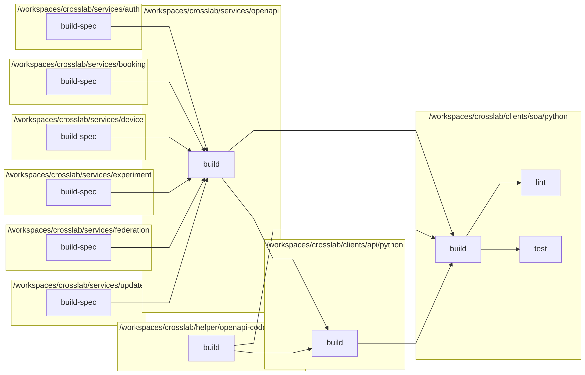

[//]: # ({{print badges}})

|     | build | lint | test |
| --- | --- | --- | --- |
| /workspaces/crosslab/clients/soa/python |   |  |  |

[//]: # ({{end}})
# Python SOA Client

## Dependency Graph
[//]: # ({{print dependency graph}})

[//]: # ({{end}})
