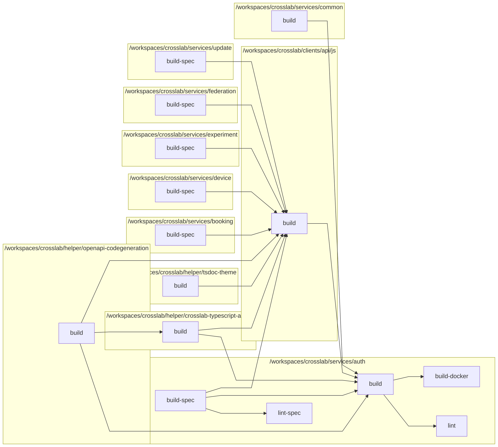

[//]: # ({{print badges}})

|     | build-spec | build | lint | lint-spec | build-docker |
| --- | --- | --- | --- | --- | --- |
| /workspaces/crosslab/services/auth |   |  |  |  |  |

[//]: # ({{end}})
# Authentication Service

## Dependency Graph
[//]: # ({{print dependency graph}})

[//]: # ({{end}})
