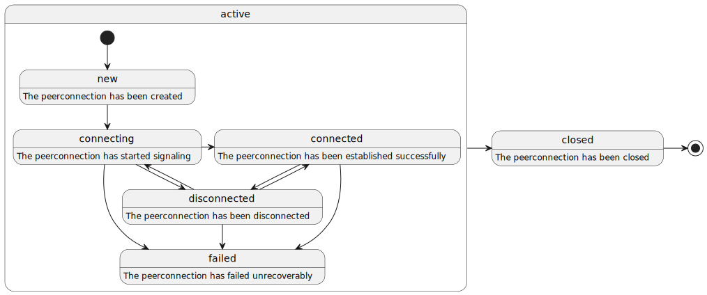
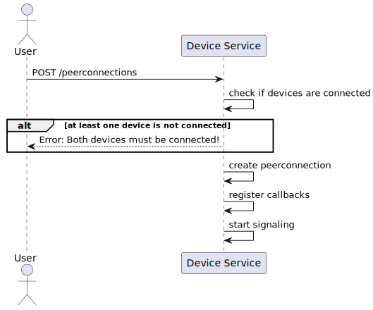
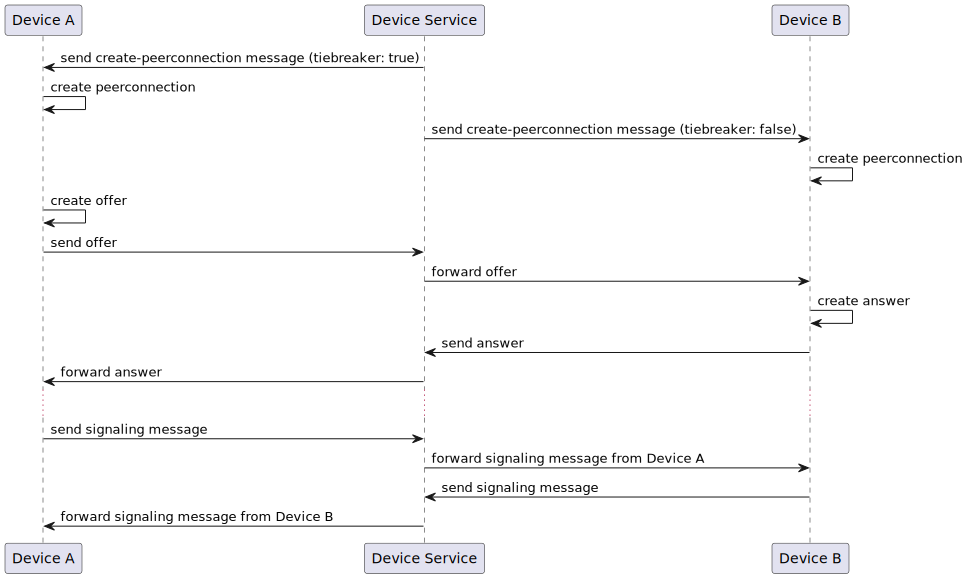
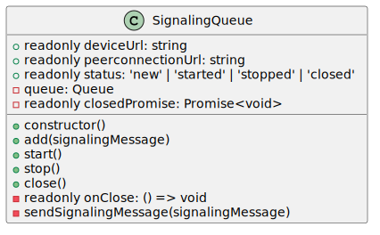
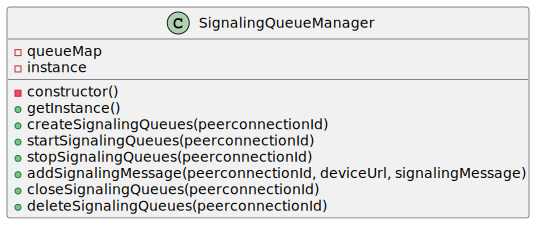
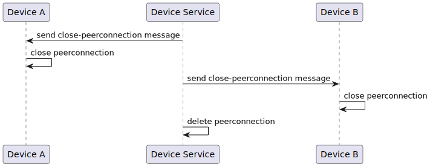
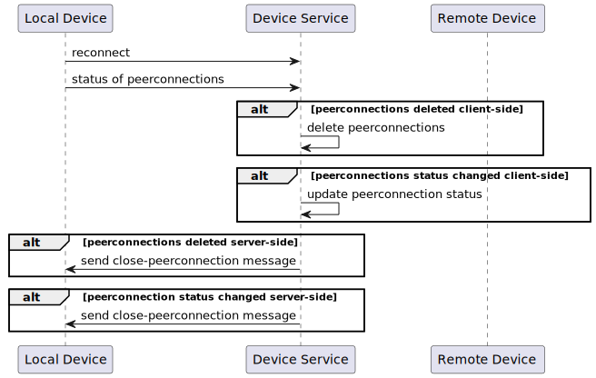

# Peerconnection Handling

Peerconnections are a direct bidirectional connection between two devices. A peerconnection may be established between devices which are not necessarily registered at the same device service.

## Peerconnection Statuses

Every peerconnection starts with the status `new`. Once the signaling has started the peerconnection changes into status `connecting`. If the peerconnection was established successfully the status changes to `connected`. If the peerconnection should disconnect at any point whilst in the status `connecting` or `connected` the status changes to `disconnected`. If the peerconnection should fail unrecoverably at any point whilst in the status `connecting`, `connected` or `disconnected` the status changes to `failed`. The status `closed` can be reached from all other statuses and does not have any outgoing transitions.



## Creation

When a user wants to create a peerconnection, the device service will first check if both devices are currently connected to their respective device services. If one of the devices is not connected the creation of the peerconnection will be stopped and a corresponding error will be sent to the user. Otherwise the peerconnection is created, all registered callbacks are registered and the signaling process is started.



## Signaling

The signaling process starts with the device service sending a `create-peerconnection` message to each device. One of the devices will be the tiebreaker and will start the signaling between the devices with a corresponding offer. Once the offer is received by the other device it will create an answer and send it to the offering device. After the answer is received further signaling messages will be exchanged (e.g. ICE-candidates).



### Signaling Queues

To ensure that all signaling messages are sent in order a signaling queue (instance of `SignalingQueue`) is created for each device of a peerconnection. A signaling queue can be constructed with the corresponding url of the peerconnection and the url of the device. During the construction an internal queue is created aswell as a Promise that will resolve once the signaling queue is closed. Once constructed a signaling queue offers methods to: 

- add signaling messages to the internal queue 
- start the internal queue 
- stop the internal queue 
- close itself
 
A signaling queue will be closed automatically as soon as it processes a `close-peerconnection` message. The method `close()` can be used to add such a message to the internal queue.



### Signaling Queue Manager

In order to simplify working with signaling queues the class `SignalingQueueManager` was added. This class is implemented as a singleton to make sure that only one instance of it may exist at any given time. A `SignalingQueueManager` holds an internal mapping from the url of a peerconnection to its associated signaling queues. Furthermore it allows to: 

- create signaling queues for a peerconnection 
- add signaling messages to a specific signaling queue
- start the signaling queues of a peerconnection
- stop the signaling queues of a peerconnection
- close the signaling queues of a peerconnection
- delete the signaling queues of a peerconnection



## Deletion

Before a peerconnection is deleted it should be closed. This ensures that the allocated resources are freed. In order to achieve this a `close-peerconnection` message is sent to both participating devices. As soon as a device receives this message it closes the corresponding peerconnection. Afterwards the device service can simply delete the peerconnection.



## Error Handling

There are a multitude of possible errors that may occur during the lifetime of a peerconnection. Here are a few examples:

- One of the devices disconnects from the device service
- A device updates its local connection state to `disconnected`
- A device updates its local connection state to `failed`
- Peerconnection status updates are lost

### Device Disconnection

When a device disconnects, the device service should wait for the device to reconnect. If the device does not reconnect within a timeframe of e.g. 2 minutes all associated peerconnections of the device should be closed and deleted. Since the device is currently not connected, the device service will have to wait until the device reconnects to send a `close-peerconnection` message to the device. However the device service should only send this message if the device reports that the connection is still present locally (`status != null`). The device service should not wait for the device to reconnect to delete the peerconnection, since the device may never return (e.g. instantiated device). The device service can simply check upon the reconnection of the device if all reported peerconnections still exist. For those that don't exist anymore, the device service should send a `close-peerconnection` message.

### Peerconnection Disconnection

When the status of a peerconnection is updated to `disconnected` a timeout could be started which closes and deletes the peerconnection after a certain time. Before closing and deleting the peerconnection the device service could poll the local status of the peerconnection one more time to make sure that it doesn't close and delete a possibly working peerconnection.

### Peerconnection Failure

When the status of a peerconnection is updated to `failed` there is currently no way to recover the peerconnection. Because of that the peerconnection should be closed and deleted and a corresponding callback should be sent to subscribed users and services.

### Lost Peerconnection Status Updates

If the status updates of a peerconnection are lost the device service may be unable to correctly handle a peerconnection. For example if a peerconnection is in the status `connecting` or `connected` and misses a status update to `disconnected`, `failed` or `closed` it may never close and delete the peerconnection. To counteract this the device service could periodically poll the devices for the local status of the peerconnection.

## Service Restart

When the device service is restarted all the signaling queues associated with the peerconnections are lost and need to be recreated. Peerconnections with status `failed` and `closed` may be directly deleted by the device service. For all other peerconnections the device service should rebuild the signaling queues. For all other peerconnections the device service needs to determine the current status of the peerconnection by polling the local status of it for each participating device. Currently there is no implemented way to do this. Here are some possible ideas:

- Add a websocket command that allows to poll a device connected to the device service and add a corresponding API-endpoint
- Add a property `connections` to concrete devices which has the following typing:
  ```typescript
  {
    /** url of the peerconnection */
    url: string,
    /** local status of the peerconnection */
    status: 'new' | 'connecting' | 'connected' | 'disconnected' | 'failed' | 'closed'
  }[]
  ```
  This property should then be sent along when a device is requested via GET /devices/{device_id}

